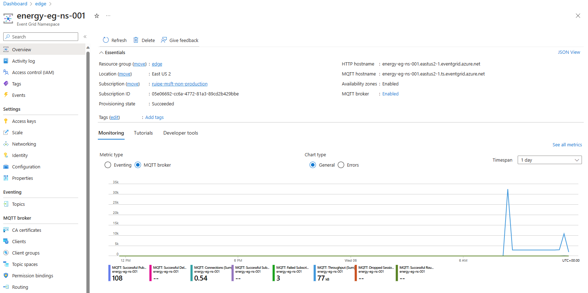
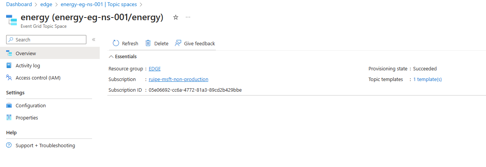
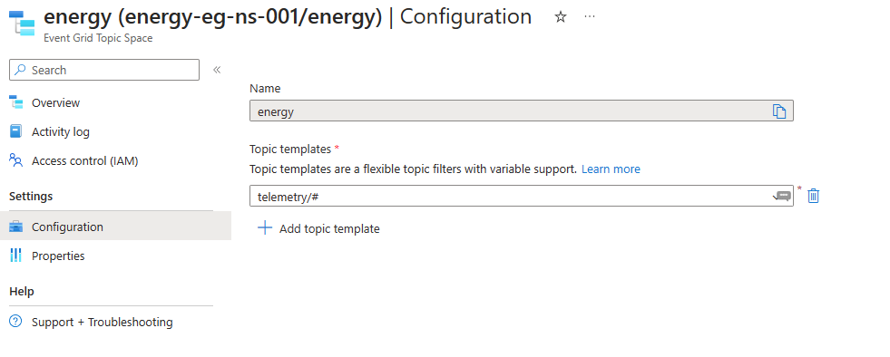
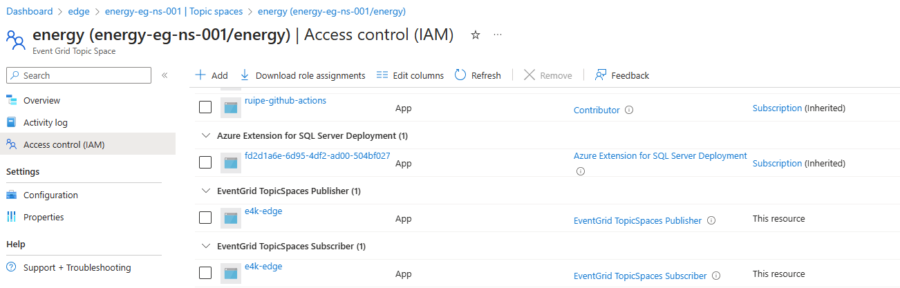
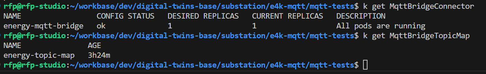
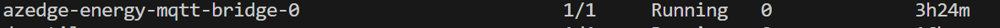
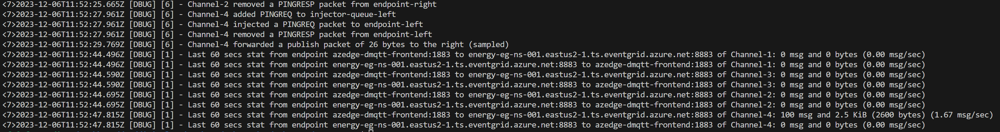
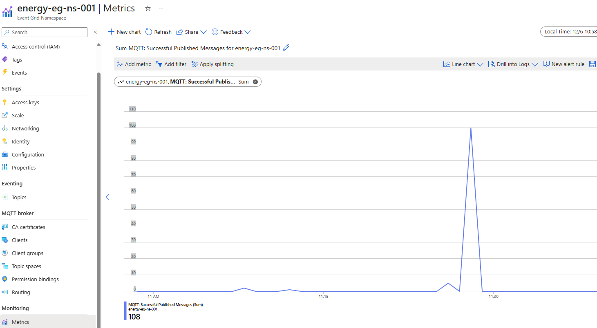
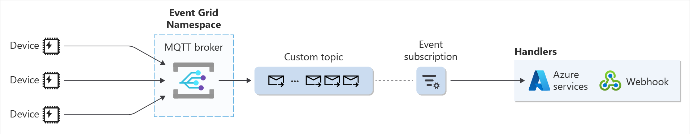

# Setup MQTT Bridge between E4K and Azure Event Grid MQTT Broker

References:
- https://www.e4k.dev/docs/cloud-connectors/mqtt-bridge
- https://learn.microsoft.com/en-us/azure/iot-operations/send-view-analyze-data/tutorial-connect-event-grid

## Configure
To minimize credential management, using the system-assigned managed identity and Azure RBAC is the recommended way to bridge E4K with Event Grid MQTT broker.

1. Deploy E4K on an Arc-connected Kubernetes cluster as an Arc extension.

2. Customize the `mqtt_bridge_setup.json` file to reflect your environment. You can create a fresh copy from the `settings.template.json` file.

3. Run the script `./mqtt_bridge_setup.sh -c settings.json` to create and deploy the following artifacts:
- In Azure:
    - Event Grid Namespace with MQTT broker enabled
    - Event Grid Topic space with a topic template
    - Give E4K managed identity access to the Event Grid topic space
    - Collect the Event Grid MQTT broker hostname
- In Kubernetes:
    - MQTTBridgeConnector resource
    - MQTTBridgeConnector topic map resource

In Azure you will have a new Event Grid Namespace with MQTT broker enabled:



With a Topic space configured:



With a Topic template:



And with a new role assignment at the Topic space level for the E4K managed identity:



On the K8s side you will have 2 resources created:



And one new Pod running:



## Test

You can use the test client provided in `mqtt_test`, edit the `pub.js` file to customize the local mqtt broker address and run `node pub.js` to publish a test message to the local mqtt broker.

To check locally yu can access the logs of the bridge pod, for example:

```bash
kubectl logs azedge-energy-mqtt-bridge-0
```

You should see something like this:



To check on the Azure Event Grid Namespace MQTT Broker, just go to the metrics tab and you should see the message count increasing:



Your MQTT bridge is working.


## Integrate with Azure Functions

Reference: https://learn.microsoft.com/en-us/azure/event-grid/mqtt-routing



We are using a custom topic as a routing destination since it will use push delivery of the events to the Function:
- Create an Event Grid custom topic where all MQTT messages will be routed. This topic needs to fulfill the Event Grid custom topic requirements for routing
- Create an Event Grid event subscription to route these messages to one of the supported Azure services or a custom endpoint.
- Set the routing configuration referring to the topic that you created in the first step.
